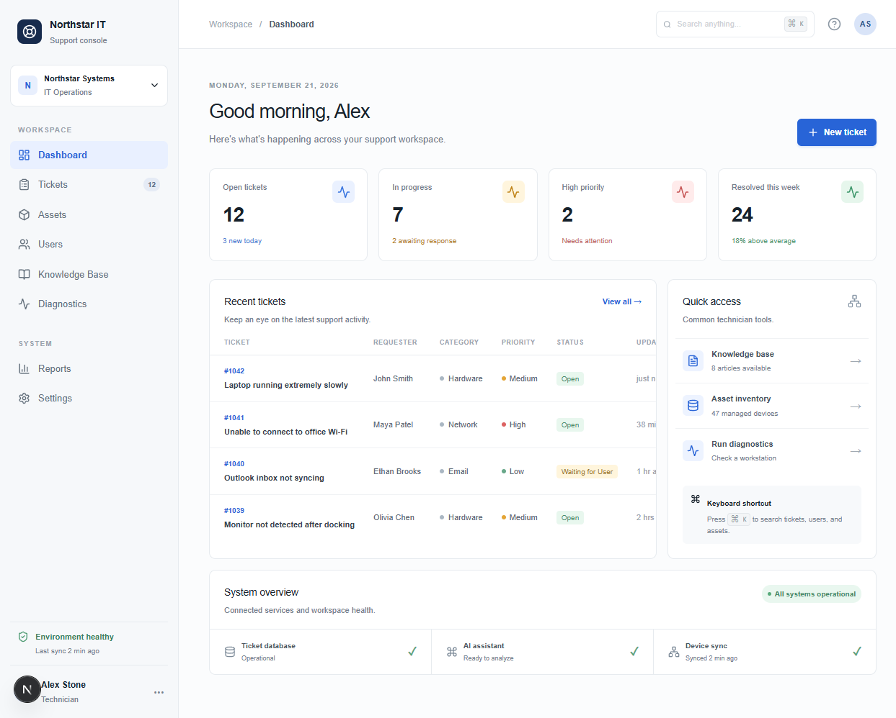
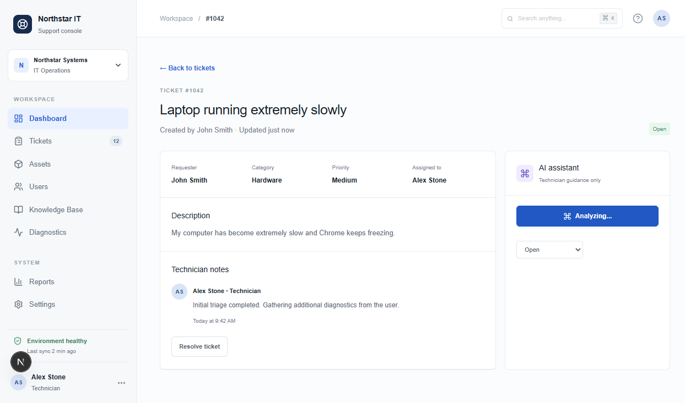
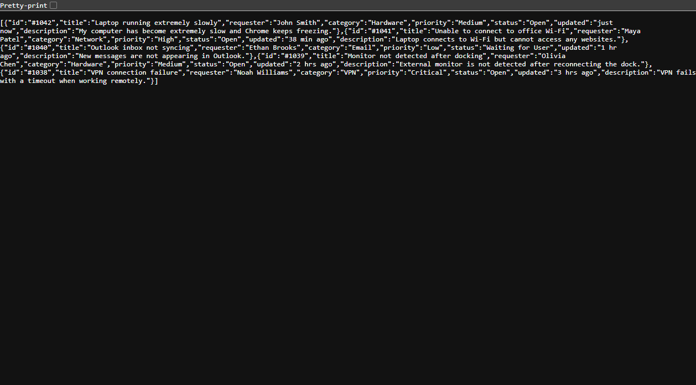

# Northstar IT Support Console

A local-first IT help desk workspace built with Next.js, React, SQLite, and Gemini. It provides ticket management, asset and user views, diagnostics, a persistent local ticket database, and server-side AI triage.

## Screenshots

### Dashboard (Current)



### Ticket Detail and Gemini Analysis



### Tickets API



## Requirements

- Node.js 24 or newer. The project uses Node's built-in `node:sqlite` support.
- A Gemini API key for AI analysis.
- No MySQL, PostgreSQL, or separate database installation is required.

## Setup

Install the frontend dependencies:

```powershell
npm install
```

Create `.env.local` in the project root:

```env
GEMINI_API_KEY=your-gemini-api-key
```

Never commit `.env.local` or place the real key in frontend code. The key is read only by the server route.

Start the app:

```powershell
npm run dev
```

Open [http://localhost:3000](http://localhost:3000).

## Local Database

The first request to the ticket API creates `northstar.db` in the project root and seeds the sample tickets. The database is ignored by Git.

Tickets are persisted through these server routes:

| Method | Route | Purpose |
| --- | --- | --- |
| `GET` | `/api/tickets` | List saved tickets |
| `POST` | `/api/tickets` | Create a ticket |
| `PATCH` | `/api/tickets` | Update a ticket status |

The browser loads tickets from SQLite on startup, so tickets and status changes survive refreshes and application restarts.

## Gemini API

AI analysis is performed by the server route [`app/api/analyze-ticket/route.ts`](app/api/analyze-ticket/route.ts). The browser sends ticket context to the route, and the route sends it to Gemini using the server-only `GEMINI_API_KEY`.

```mermaid
flowchart LR
  UI[Ticket detail panel] -->|POST title, description, device, errorText| Route[/api/analyze-ticket]
  Route -->|GEMINI_API_KEY| Gemini[Gemini API]
  Gemini -->|JSON summary, causes, steps, severity, confidence| Route
  Route --> UI
```

Example request:

```json
{
  "title": "Laptop running extremely slowly",
  "description": "Chrome freezes frequently.",
  "device": "Dell Latitude 5440",
  "errorText": "No explicit error message"
}
```

The response contains:

```json
{
  "summary": "...",
  "likelyCauses": ["..."],
  "recommendedSteps": ["..."],
  "severity": "Medium",
  "confidence": 0.85
}
```

## Optional Flask Backend

The repository also contains a small Phase 1 Flask backend under `backend/`. It is separate from the Next.js ticket UI.

```powershell
cd backend
python -m venv .venv
.\.venv\Scripts\Activate.ps1
pip install -r requirements.txt
python app.py
```

The Flask page runs at [http://localhost:5000](http://localhost:5000).

## Useful Commands

```powershell
npm run dev    # Start development server
npm run build  # Create a production build
npm run start  # Start the production build
```

## Project Structure

- `app/page.tsx`: Main support console UI
- `app/api/tickets/route.ts`: Ticket persistence API
- `app/api/analyze-ticket/route.ts`: Gemini analysis API
- `lib/ticket-db.ts`: SQLite database setup and ticket operations
- `public/screenshots/`: README screenshots
- `backend/`: Optional Flask Phase 1 backend
